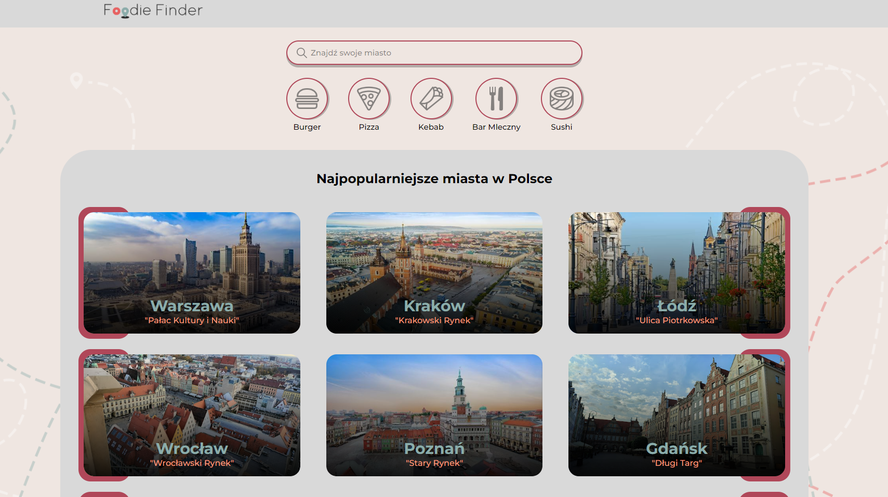
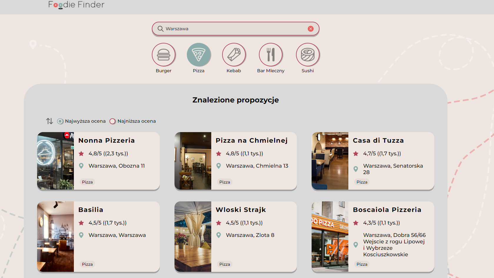
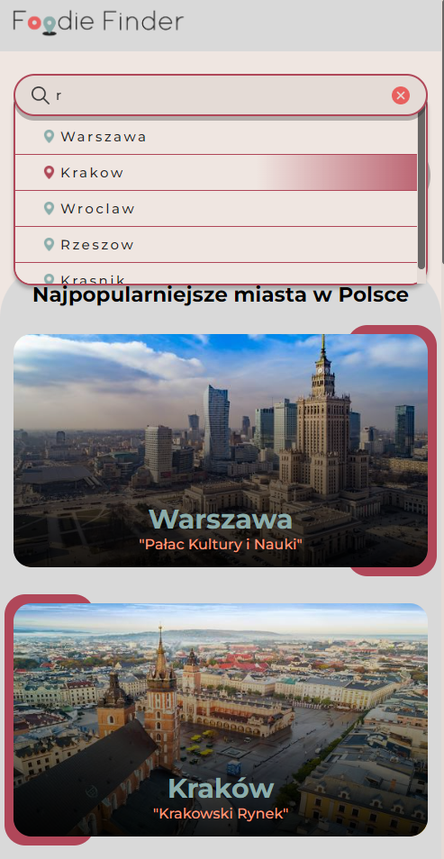
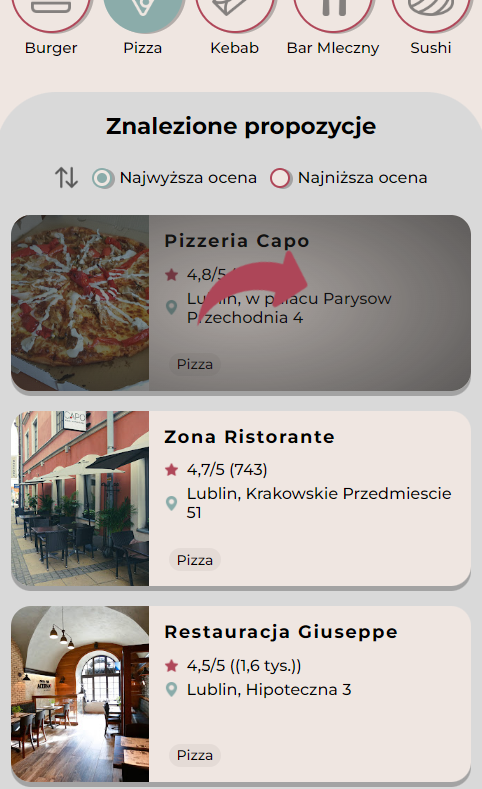

<h2>Description</h2>
Fullstack web application that allow to choose specific city in Poland and find most popular restaurants. User can filter data by food types and city.

<h2>Tech</h2>
-Frontend (Angular, Regular CSS) 
-Backend (Java, PostgreSQL)

<h2>Gallery</h2>
</img> </img>
<table>
  <tr>
    <td>
      </img>
    </td>
   <td>
      </img>
    </td>
  </tr>
</table>

<h2>Contribution</h2>
-Data and images provided by Google. 
-Icons provided by <a href="https://www.flaticon.com/">Flaticon</a>.

<h2>Authors</h2>
- https://github.com/xMatty522 
- https://github.com/Squashim
